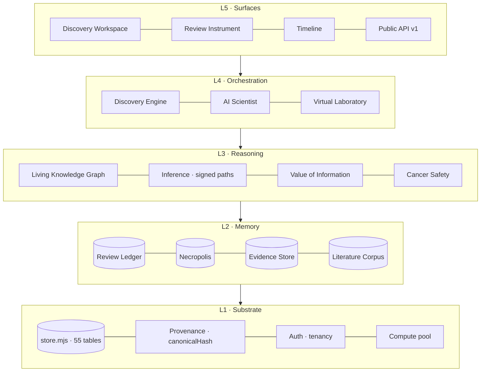
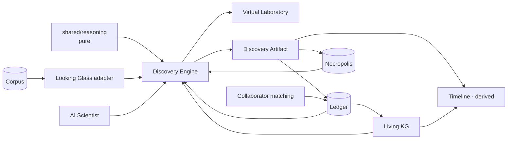
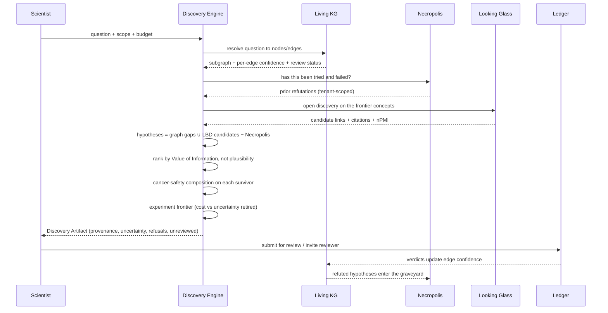

# Genesis Discovery OS — architecture

**Status: design, not built.** Nothing in this document describes existing
behaviour except §1, which is an inventory of what is already in the repository.
Everything from §2 onward is a proposal.

---

## 1. What already exists — the inventory that reframes the task

The mission brief asks for eight modules. Seven of the eight already exist in
some form, in one of **three disconnected worlds**. The real work is not
construction; it is integration, and repairing one structural fault.

### 1.1 The three worlds

| World | Location | Size | Domain | Knows about the others? |
|---|---|---|---|---|
| **A — Campaign stack** | `backend/src/cognitive/` | 47 modules, ~6.5k lines | Molecules: docking, ADMET, off-target, MD, funnels | No |
| **B — Literature stack** | `backend/src/lookingGlass/` | 6 modules, separate DB | PubMed corpus, MeSH, Swanson ABC, benchmark | No |
| **C — Reasoning stack** | `frontend/src/core/longevity/` | 18 modules, ~5.3k lines | Mechanism graph, evidence grading, cancer safety, VoI | **No backend at all** |

Verified: `grep` finds no import of `lookingGlass`, `edgeReview` or `longevity`
anywhere in `cognitive/`; no import of `cognitive` in `lookingGlass/`; and no
`fetch` or `/api/` call anywhere in `core/longevity/`.

The one bridge that exists is the review ledger: `backend/src/edgeReview.mjs` ←
`/api/review` ← `frontend/components/longevity/EdgeReview.tsx`. It is also the
only asset in the system with a genuine network effect.

### 1.2 The eight requested modules, mapped honestly

| # | Requested | Reality | Gap |
|---|---|---|---|
| 1 | AI Scientist | `autonomousLoop`, `missionPlanner`, `agentFabric`, `criticSwarm`, `hypothesisEngine`, `metaOrchestrator` all exist (World A) | Reads no literature (World B unwired); emits nothing reviewable; scoped to molecules only |
| 2 | Global Discovery Network | `campaign_invites`, `campaign_members`, `edgeReview` ledger exist | No discovery of people, no cross-project surface, no reason yet for a stranger to join |
| 3 | Virtual Laboratory | `core/longevity/discovery.ts` (VoI, `FEASIBLE_OUTCOMES`, `TIER_EFFORT`, `experimentFrontier`), `laboratoryReadiness.mjs`, `computeOrchestrator.mjs` | Split across worlds A and C; no cost model in currency; no equipment model |
| 4 | Necropolis | `cognitive/necropolis.mjs` — tenant-isolated, content-hashed, import/export, mutation-hardened | Remembers **parameter regions of molecule campaigns only**. Has no memory of a refuted hypothesis, a retracted paper, or a disputed mechanism edge |
| 5 | Living Knowledge Graph | Two graphs: `cognitive/knowledgeGraph.mjs` (provenance of a campaign run) and `core/longevity/hallmarks.ts` + `inference.ts` (signed mechanism digraph) | Neither is temporal. No confidence evolution, no contradiction detection, no automatic update |
| 6 | Discovery Timeline | — | Does not exist. The data does: `lg_articles.year`, `edge_reviews.created_at`, `formal_failure_regions`, `campaign_events` |
| 7 | Discovery Engine | Pieces exist in all three worlds | No single flow. Nothing composes them |
| 8 | Discovery OS | — | This document |

### 1.3 The structural fault, and why it blocks everything

**World C — the actual scientific reasoning core — is client-side only.**
Evidence records live in React component state. The mechanism graph is a
TypeScript constant. Nothing persists, nothing has provenance, nothing is
multi-user, nothing can be remembered or reviewed or replayed.

Every one of the eight requested modules requires that graph to be a durable,
addressable, versioned object on the server. **This is the foundation stone, and
no other phase can start before it.**

---

## 2. The one thing I am pushing back on

> "AI Scientist — an autonomous scientific researcher that … produces scientific
> reports."

Built as stated, this destroys the asset we have spent this whole effort
building.

Genesis's entire credibility thesis is: *it never claims a therapy works; it says
what humanity should investigate next, and why; and expert review is what makes
its answers worth anything.* An autonomous agent that emits scientific reports is
the single fastest way to become indistinguishable from every other LLM wrapper
in this space — all of which produce confident scientific prose, and none of
which are believed by anyone who can evaluate them.

There is also a hard technical reason. `autonomousLoop.mjs` already returns
`BLOCKED_BY_RUNTIME` for "fetch new publications" and "find new targets" rather
than fabricating them. That refusal is correct and it is the module's most
valuable line of code. Scaling autonomy up without scaling that discipline up
converts a careful system into a plausible-sounding one.

### The version that is both honest and more defensible

**The AI Scientist produces decisions under review, never conclusions.**

Every artifact it emits carries four mandatory fields, enforced at the type level
and refused at the persistence layer if absent:

| Field | Meaning |
|---|---|
| `provenance` | Every input: article ids, edge keys, review verdicts, corpus checksum |
| `uncertainty` | Coverage-based (about the literature) and belief-based (about biology), kept separate |
| `reviewStatus` | `unreviewed` → `reviewed` → `expert-confirmed` / `disputed` |
| `refusals` | What it declined to conclude, and why — a first-class output, not an error |

Nothing it emits may be exported, published or shown as a finding until a named
human has signed it. That constraint is not a limitation to work around; it is
what makes the output worth reading, **and it is what feeds the ledger**, which
is the only compounding asset in the system.

---

## 3. Defensibility ranking — this drives the roadmap

Per the closing instruction: prefer what compounds and resists copying over what
merely adds capability.

| Asset | Network effect | Replication cost for a competitor | Verdict |
|---|---|---|---|
| **Expert review ledger** | Strong — each verdict raises the value for every user | Very high: requires recruiting named scientists one at a time | **Moat** |
| **Necropolis (per-tenant failure memory)** | Per-tenant compounding; switching cost rises monthly | Impossible to copy — it is the customer's own history | **Moat** |
| **Benchmark + provenance discipline** | None | Low to copy, high to *want* — it requires publishing your failures | **Trust moat** |
| **Living Knowledge Graph** | Moderate | The graph is copyable; the review history over it is not | Moat only if reviewed |
| **Discovery Timeline** | None | Low | Demo value, high; strategic value, low |
| **Virtual Laboratory** | Weak | Moderate | Revenue value, high |
| **Discovery Engine** | None by itself | Low — any team with an LLM ships one in a month | Funnel, not moat |
| **AI Scientist** | None by itself | Low | Funnel, not moat |

### The architectural invariant this produces

> **The network effect is not a module. Every module must write into the ledger
> and the Necropolis, or it does not ship.**

A "Global Discovery Network" built as a separate social product would be a second
empty room. The network is what happens when eight modules all deposit reviewable
artifacts into one ledger that scientists already have a reason to visit.

---

## 4. System architecture

Five layers. A layer may depend only on layers below it. This is enforced by a
static test (§10), the same way `serverRouting.test.mjs` enforces route
registration today.



### 4.1 Module boundaries — the rules that keep it coherent

1. **L3 is pure.** No I/O, no database handle, no clock. Inference, VoI and safety
   analysis take data and return data. This is already true of `core/longevity/`
   and is the reason it can be moved to the server unchanged.
2. **L2 owns all persistence.** L3 never writes. L4 never writes directly — it
   writes through L2 so every write carries provenance.
3. **L4 may not conclude.** Orchestrators compose L3 results and attach
   uncertainty and refusals. Any statement of fact must trace to an L2 record.
4. **One direction only.** `lookingGlass` may not import `cognitive`;
   `cognitive` may not import `lookingGlass`. Both may import L1 and L2. The
   bridge between literature concepts and mechanism nodes is the existing
   `lg_node_map` table, and it is the *only* bridge.
5. **Every L4 output is an artifact.** Addressable, hashed, reviewable,
   replayable. Not a response body.

### 4.2 Where the three worlds land

| World | Becomes | Change required |
|---|---|---|
| C — `core/longevity/` | **L3 Reasoning**, shared by server and client | Move to `packages/shared/reasoning/`; strip React; keep pure |
| B — `lookingGlass/` | **L2 Corpus** + an L3 discovery adapter | Wire `lg_node_map` to the mechanism graph |
| A — `cognitive/` | **L4 Orchestration** + **L2 Necropolis** | Split: the 12 modules that persist move to L2; the rest become L4 orchestrators |

---

## 5. Dependency graph



Two properties to notice:

- **The ledger and the Necropolis are both sinks and sources.** That cycle is the
  compounding loop. Everything else is a tree hanging off it.
- **Timeline has no writes.** It is derived, always, exactly as `edgeStatus` is
  derived today. A cached timeline is a timeline that can lie.

---

## 6. Execution flow — the flagship Discovery Engine

User submits: *"Can biological age be reversed without increasing cancer risk?"*



### 6.1 The eight stages, and what each may not do

| Stage | Produces | Forbidden |
|---|---|---|
| 1 Resolve | Question → subgraph | Inventing a node not in the graph |
| 2 Recall | Prior failures | Reading another tenant's Necropolis |
| 3 Read | LBD candidates with citations | Emitting a candidate with no retrievable citation |
| 4 Generate | Hypotheses | Any hypothesis already in the graveyard, unless flagged as a deliberate re-test |
| 5 Rank | VoI ordering | Ranking by plausibility or by model confidence |
| 6 Check | Cancer-safety composition | Averaging conflicting mechanisms — conflicts are reported, never resolved |
| 7 Plan | Experiment frontier | Proposing an outcome the assay cannot measure (`FEASIBLE_OUTCOMES`) |
| 8 Emit | Artifact | Claiming a therapy works; emitting without `refusals` populated |

Stage 4's subtraction is the Necropolis paying rent. Stage 5's ranking rule is
what makes the engine honest: a null result retires the same coverage uncertainty
as a positive one, so the ordering does not reward wishful thinking.

---

## 7. Database design

Two databases, kept separate on purpose: the corpus is bulk-append and rebuilt
wholesale; the OS is transactional and never rebuilt. The bridge is `lg_node_map`,
which already exists.

### 7.1 New tables (migration v29 →)

**Living Knowledge Graph — temporal by construction.**

```sql
-- A claim is a node-node assertion. It is never updated in place.
CREATE TABLE graph_claims (
  id           TEXT PRIMARY KEY,
  project_id   TEXT NOT NULL,
  subject      TEXT NOT NULL,        -- mechanism node or MeSH ui
  predicate    TEXT NOT NULL,        -- promotes | counteracts | targets | …
  object       TEXT NOT NULL,
  created_at   INTEGER NOT NULL,
  retired_at   INTEGER,              -- NULL = live. Retired, never deleted.
  UNIQUE (project_id, subject, predicate, object, created_at)
);

-- Every change of belief is an append. Confidence is a history, not a number.
CREATE TABLE claim_revisions (
  id            TEXT PRIMARY KEY,
  claim_id      TEXT NOT NULL REFERENCES graph_claims(id),
  at            INTEGER NOT NULL,
  confidence    REAL NOT NULL,       -- belief-based
  coverage      REAL NOT NULL,       -- literature-based, kept separate on purpose
  cause         TEXT NOT NULL,       -- review | new-evidence | retraction | contradiction
  cause_ref     TEXT,                -- review id, article id, retraction notice
  provenance    TEXT NOT NULL        -- canonicalHash of the inputs
);

-- Contradictions are recorded, never auto-resolved.
CREATE TABLE claim_contradictions (
  id           TEXT PRIMARY KEY,
  claim_a      TEXT NOT NULL REFERENCES graph_claims(id),
  claim_b      TEXT NOT NULL REFERENCES graph_claims(id),
  kind         TEXT NOT NULL,        -- sign-conflict | temporal | source-conflict
  detected_at  INTEGER NOT NULL,
  resolved_at  INTEGER,
  resolved_by  TEXT,                 -- a named human, or NULL
  resolution   TEXT
);
```

**Necropolis, extended beyond parameter space.**

```sql
-- Distinct from formal_failure_regions (which is molecule parameter regions).
CREATE TABLE hypothesis_graveyard (
  id            TEXT PRIMARY KEY,
  project_id    TEXT NOT NULL,
  content_hash  TEXT NOT NULL,       -- dedup within tenant
  statement     TEXT NOT NULL,
  subject       TEXT, predicate TEXT, object TEXT,
  buried_at     INTEGER NOT NULL,
  cause         TEXT NOT NULL,       -- refuted | failed-replication | retracted | superseded
  evidence_ref  TEXT NOT NULL,       -- what killed it — mandatory
  lesson        TEXT,                -- free text, the part humans actually reuse
  resurrectable INTEGER NOT NULL,    -- 1 = worth re-testing if the method improves
  UNIQUE (project_id, content_hash)
);
```

**Virtual Laboratory.**

```sql
CREATE TABLE experiment_plans (
  id             TEXT PRIMARY KEY,
  project_id     TEXT NOT NULL,
  artifact_id    TEXT NOT NULL,
  hypothesis_id  TEXT NOT NULL,
  assay_tier     TEXT NOT NULL,      -- in-vitro | organoid | mouse | human-cohort | RCT
  outcome        TEXT NOT NULL,      -- must be in FEASIBLE_OUTCOMES for the tier
  cost_estimate  REAL, cost_currency TEXT, cost_basis TEXT NOT NULL,
  duration_days  INTEGER,
  equipment      TEXT,               -- JSON list
  info_gain      REAL NOT NULL,      -- uncertainty retired
  created_at     INTEGER NOT NULL
);
```

**Discovery artifacts — the unit of everything.**

```sql
CREATE TABLE discovery_artifacts (
  id            TEXT PRIMARY KEY,
  project_id    TEXT NOT NULL,
  question      TEXT NOT NULL,
  engine_version TEXT NOT NULL,
  corpus_sha256 TEXT,                -- which literature snapshot
  vocabulary    TEXT,                -- which MeSH release
  inputs_hash   TEXT NOT NULL,       -- replay key
  body          TEXT NOT NULL,       -- JSON
  refusals      TEXT NOT NULL,       -- JSON, may be '[]' but never absent
  created_at    INTEGER NOT NULL,
  created_by    TEXT NOT NULL,
  review_status TEXT NOT NULL DEFAULT 'unreviewed'
);
```

### 7.2 Two design rules

- **Nothing is updated in place; nothing is deleted.** Retirement is a column.
  This is what makes the Timeline derivable and the Necropolis trustworthy.
- **Nothing derived is stored.** Edge status, timeline, current confidence and
  contradiction lists are all computed from the append-only tables — the same
  decision already made for `edgeStatus` in `edgeReview.mjs`.

---

## 8. API

Following the existing `seg[0]` dispatch in `api.mjs`, with the prefix registered
in `PERSIST_API_PREFIXES` (the `serverRouting.test.mjs` guard already enforces
that pairing).

| Method | Route | Purpose | Auth |
|---|---|---|---|
| POST | `/api/discovery/ask` | Submit a question → artifact id (async) | user |
| GET | `/api/discovery/artifact/:id` | Fetch artifact with provenance | public if published |
| POST | `/api/discovery/artifact/:id/replay` | Re-run against a newer corpus, diff the two | user |
| GET | `/api/graph/claim/:key/history` | Confidence over time | public |
| GET | `/api/graph/contradictions` | Open contradictions | public |
| GET | `/api/timeline` | Derived timeline, filterable | public |
| POST | `/api/necropolis/bury` | Record a refutation | user |
| POST | `/api/necropolis/assess` | Has this been tried? | user |
| POST | `/api/lab/plan` | Experiment frontier for a hypothesis | user |
| GET | `/api/network/reviewers?edge=` | Who is qualified and available | user |
| POST | `/api/review/submit` | *(exists)* | user |

**Replay is the API that sells the system.** "This is what Genesis concluded in
March; here is the same question against today's literature; here are the three
claims that changed and the papers that changed them." No competitor can produce
that without append-only history from the start.

---

## 9. Scalability and security

### 9.1 Scale — where it actually breaks

| Component | Current ceiling | Fix, when needed |
|---|---|---|
| Corpus co-occurrence | O(concepts² per article); 500k articles is fine in SQLite | Partition by MeSH branch before 5M |
| `rebuildStatistics` | Full rebuild, minutes at 500k | Incremental rebuild keyed on `stats_through_year` |
| Discovery Engine | Seconds per question | Queue + worker pool (`ASYNC_EXECUTION` flag exists) |
| Ledger | Trivial | — |
| Necropolis assess | Linear scan per tenant | Index on `content_hash`; k-d tree past ~10⁵ regions |

The honest statement: **nothing here is currently limited by scale.** It is
limited by having no corpus and no reviewers. Building for 5M articles before
ingesting 500k would be the classic mistake.

### 9.2 Security model

- **Tenancy is a read filter, not a convention.** The Necropolis contract already
  states this; every new table carries `project_id` and every read is filtered.
  A static test asserts no query against a tenant table omits the filter.
- **Publication is explicit.** An artifact is private until published. Publishing
  is an append with a named actor.
- **The ledger is public-readable by design** — that is the recruitment
  instrument — but writes require identity.
- **No cross-tenant negative-knowledge exchange.** Tempting, and legally
  hazardous. If it ever ships it is a separate, reviewed design with opt-in.
- **Provenance is not optional.** The persistence layer refuses an artifact whose
  `refusals` field is absent or whose `inputs_hash` does not verify.

---

## 10. Testing strategy

The standard already in force continues, and is extended with two new static
guards.

1. **Fail-closed by default.** Unknown → refuse. Already true of
   `rebuildStatistics`, `conceptsValidAt`, `loadReleaseFromStream`.
2. **Mutation-test every refusal.** A refusal that can be deleted with tests
   still green is not a refusal. This session caught three that way.
3. **Layer guard (new).** A static test parses imports and fails if L3 imports a
   database handle, or if `lookingGlass` and `cognitive` reference each other.
4. **Tenancy guard (new).** A static test fails if any query against a
   `project_id` table lacks the filter.
5. **Synthetic fixtures must be unmistakable.** `FIXTURE-…` ids, `D9…` UIs,
   impossible PMIDs. A fixture that leaks must be obvious, not plausible.
6. **Every artifact type gets a replay test.** Same inputs → same `inputs_hash` →
   same body.

---

## 11. Roadmap

Ordered by defensibility × scientific value, which is deliberately **not** the
order of visual impressiveness.

| Phase | Deliverable | Why here | Effort | Moat |
|---|---|---|---|---|
| **0** | Move `core/longevity/` to `packages/shared/reasoning/`, persist the mechanism graph, wire the frontend to the server | Nothing else is possible until the reasoning core is a durable server object | 1–2 wks | Enabler |
| **1** | Living Knowledge Graph: `graph_claims` + `claim_revisions` + contradiction detection | Substrate for Timeline, Necropolis-of-hypotheses, replay | 2–3 wks | Medium |
| **2** | Necropolis for hypotheses and edges | Cheap given Phase 1; compounds from day one; per-tenant, uncopyable | 1 wk | **High** |
| **3** | Discovery Timeline (derived) | Falls out of Phase 1 nearly free; strongest demo in the product | 3–5 days | Low |
| **4** | Virtual Laboratory: cost, equipment, frontier | VoI already exists; this is what a lab pays for | 2 wks | Revenue |
| **5** | Discovery Engine (the eight-stage flow) | Composes 0–4; the flagship | 2–3 wks | Funnel |
| **6** | Replay API + artifact diff | The thing no competitor can retrofit | 1 wk | **High** |
| **7** | AI Scientist as orchestrator, under review | Last, deliberately. Least defensible, most credibility risk if first | 3–4 wks | Funnel |
| **∞** | Global Discovery Network | Not a phase. An invariant: every phase writes reviewable artifacts into the ledger | — | **Highest** |

**Total to a complete Discovery OS: 13–18 weeks**, of which phases 0–3 (5–7
weeks) produce the compounding assets and phases 4–7 produce the sellable ones.

### The two blockers no amount of engineering removes

1. **No corpus.** PubMed and NLM are both egress-blocked here. Phases 1–3 work on
   the curated mechanism graph and do not need it; phase 5 does.
2. **No reviewers.** The ledger is built, tested, and empty. One named biologist
   using it is worth more than any module in this document.

---

## 12. What I recommend, in one paragraph

Do phases 0–3 first and resist the order the brief implies. They are unglamorous
— moving code to the server, appending rows instead of updating them, deriving a
timeline — and they are the only phases that produce something a competitor
cannot ship in a month. The AI Scientist and the Discovery Engine are the demos
that raise money; the append-only graph, the failure memory and the replay API
are the reasons the money is still there in three years. Build the boring half
first, while there is still no pressure to ship the impressive half.
