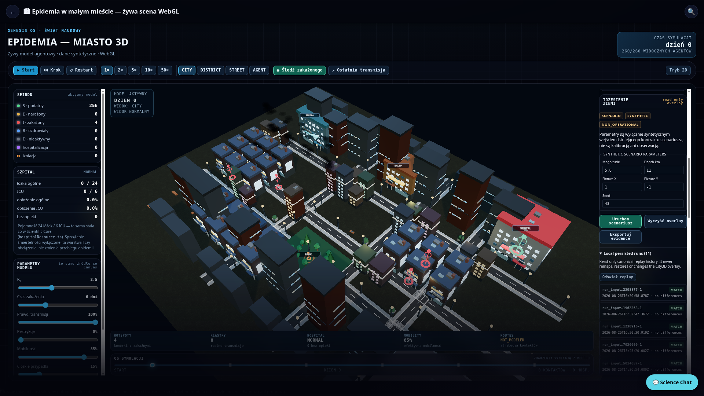
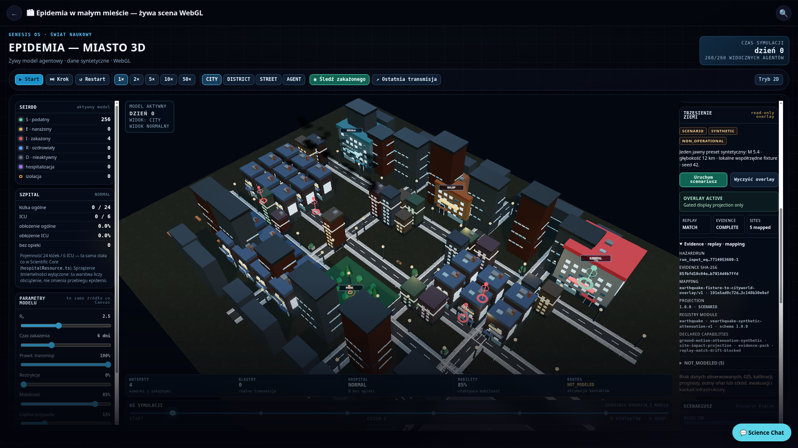

# Earthquake → Digital Twin Demonstrator

**Status:** validated synthetic scenario demonstrator.
**Scope:** one existing Earthquake vertical slice presented in one existing City3D renderer.
**Scientific status:** `SCENARIO` · `SYNTHETIC` · non-calibrated · non-operational.



## Purpose and boundary

This demonstrator connects an already audited, deterministic synthetic Earthquake slice to the existing Genesis City3D command center without creating a second city, renderer, world-state type, hazard solver, live-data adapter, GIS layer, cascade model, or epidemic coupling. It is intended to demonstrate a traceable integration seam, not to represent observed seismic information or operational decision support.

> The City3D overlay is a **read-only display projection**. It neither changes the `EpidemicCitySimulation` nor writes to `WorldStateView`, agents, contacts, movement, routing, hospital outcomes, or epidemic replay.

| Boundary | Demonstrator behavior | Explicitly excluded |
|---|---|---|
| Earthquake source | Uses the existing synthetic five-site fixture and audited scenario runner. | Observed events, real coordinates, calibrated source models, live feeds. |
| Provenance | Persists actual `SourceArtifact`, `HazardInput`, and `HazardRun` in `LocalHazardProvenanceStore`. | A new evidence store or fabricated provenance. |
| Evidence and replay | Builds the existing hazard evidence pack and invokes canonical `replayHazardRun` with `earthquakeEvaluator`; an overlay requires `MATCH`. | Local replay logic, silent acceptance of drift, or missing evidence. |
| City mapping | Uses a versioned, fingerprinted fixture-to-existing-anchor mapping. | Nearest-building matching, label inference, GIS, facility association, real geography. |
| City3D | Uses the established one-renderer/one-canvas `EpidemicCity3DSim` and a dedicated non-interactive overlay group. | A second canvas, alternate CityWorld, or an Earthquake extension of epidemic WorldState. |

## Executable path

The command-center service composes existing contracts in a deliberate order. The UI does not shortcut any of these gates.

```text
Declared synthetic preset
  → buildEarthquakeDemoEnvelope()
      → validation → existing runner → immutable persistence
      → registered module admission → evidence → canonical replay MATCH
      → pure Earthquake projection
  → projectEarthquakeToCityOverlay()
  → evaluateScenarioOverlayEligibility()
  → setEarthquakeScenarioOverlay(overlay) only when enabled
```

The `EarthquakeScenarioPanel` exposes a clearly declared synthetic preset — magnitude 5.4, depth 12 km, local fixture coordinates, seed 42 — and uses an intentionally unique scenario label for each user-triggered run. This respects immutable local provenance: re-running a different record under a previously used ID is not silently allowed.

### Gate conditions

The overlay eligibility gate allows display only when the policy is explicitly enabled, the schema is supported, every site is `SCENARIO`, the evidence pack is complete, replay returns `MATCH`, and mapping ID/version/fingerprint are all present. The workflow tests exercise the approved case and an unsupported-schema block that returns `overlay: null` even though the upstream synthetic run itself completes.

| Gate | Display result when it fails |
|---|---|
| Integration disabled or unsupported schema | No overlay is passed to City3D. |
| Any status other than `SCENARIO` | No overlay is passed to City3D. |
| Incomplete evidence | No overlay is passed to City3D. |
| Replay is not `MATCH` | No overlay is passed to City3D. |
| Mapping missing or malformed | No overlay is passed to City3D. |

## Synthetic coordinate mapping

`earthquakeCoordinateMapping.ts` is the sole bridge from opaque synthetic Earthquake fixture coordinates to the existing city display. It maps only the five known fixture IDs (`site-alpha` through `site-echo`) to stable CityWorld anchor identifiers. The mapping declares its source and target coordinate systems, schema version, `SCENARIO` status, deterministic SHA-256 fingerprint, and a stable mapping ID.

The anchors are **display anchors only**. They do not claim that an Earthquake fixture site is an actual school, shop, home, hospital, real facility, or geographic location. The adapter rejects unsupported schema versions, non-scenario data, and unmapped fixture sites instead of guessing a location.

## UI and renderer behavior

The panel is a compact item in the existing right rail. It displays `SCENARIO`, `SYNTHETIC`, and `NON_OPERATIONAL`, then exposes the actual replay verdict, evidence completeness, mapped-site count, hazard-run identifier, evidence SHA-256, mapping fingerprint and Earthquake `NOT_MODELED` list.

When the gate approves the projection, `EpidemicCity3DSim.setEarthquakeScenarioOverlay()` stores it as an immutable renderer input and synchronizes a separate non-interactive marker group. Severity/uncertainty rings, stems and tetrahedron markers are visual annotations only. Clearing the scenario calls the same setter with `null`; evidence remains available in the panel while the display readout truthfully becomes `OVERLAY CLEARED`. An upstream envelope block is displayed with its named code and reason and always clears/withholds the overlay.

The panel also offers **Eksportuj evidence**. It creates a local browser JSON download from exactly the current execution record using existing canonical serialization. A READY export contains the real artifact, input, run, evidence, replay, projection, explicit mapping and overlay-gate result. A BLOCKED export contains its truthful named block and has `mapping: null` and `overlay: null`. Every export is explicitly labelled `SCENARIO`, `SYNTHETIC` and `NON_OPERATIONAL`; it performs no network request, external publishing, data acquisition or simulation mutation.

The same panel now lists local persisted Earthquake `HazardRun` records from `LocalHazardProvenanceStore`. Each row is a read-only summary of an actual stored run and its newly recomputed canonical, registry-fenced replay verdict; it does not reuse a cached UI status. Refreshing history never remaps a fixture, restores an overlay, changes City3D, or mutates the run. Missing/non-Earthquake records are not fabricated into the list.

The panel exposes the existing scenario-contract fields for magnitude, depth, opaque fixture X/Y and seed. They are explicitly synthetic numeric inputs, not calibrated ranges, observations or real geography. Values pass unchanged to the audited validator: finite values with depth `>= 0` can enter the normal evidence/replay/mapping flow; non-finite or negative-depth input returns the existing named `INVALID_SCENARIO_SPEC` envelope block and renders no overlay.

## Runtime proof

The scripted Chromium proof ran against `#/city3d` at **1920×1080**. It dismissed only the first-run onboarding gate, then performed a real UI click on **Uruchom scenariusz**, opened the evidence/mapping details, captured the screenshot above, clicked **Wyczyść overlay**, and asserted the cleared state.

| Runtime assertion | Observed result |
|---|---|
| Existing City3D canvas count | Exactly one `.city-3d-canvas` before, during and after clear. |
| Active display state | `OVERLAY ACTIVE`. |
| Synthetic disclosure | `SCENARIO` and `SYNTHETIC` visible. |
| Provenance proof | `REPLAY MATCH`, `EVIDENCE COMPLETE`, evidence SHA-256 and mapping details visible. |
| Limit disclosure | `NOT_MODELED (5)` visible. |
| Clear behavior | `OVERLAY CLEARED`; City3D remained present and no WebGL failure state appeared. |
| Browser diagnostics | No captured warning or error entries. |

The Chromium proof also clicks **Eksportuj evidence**, captures exactly one local JSON file and parses it. Both development and production-preview proofs assert export schema `1.0.0`, `READY`, `MATCH`, complete evidence, a real mapping fingerprint and all three synthetic/non-operational labels before clearing the overlay. The persisted-history proof additionally opens the local history, observes at least one real `MATCH` record, and verifies the existing one City3D canvas and clear transition remain unchanged.

The parameter-control proof sets a valid custom synthetic record (`M 5.8`, depth `11`, fixture X/Y `1/-1`, seed `43`) and confirms the persisted local evidence export contains magnitude `5.8`, depth `11` and seed `43` with `MATCH`. It then sets depth `-1` and confirms the current validator presents `ENVELOPE BLOCKED` / `INVALID_SCENARIO_SPEC`, `NOT_RENDERED`, and the same single City3D canvas without console diagnostics.

Machine-readable results are retained in `artifacts/earthquake-city3d-runtime-proof.json`; the proof procedure and observations are summarized in `artifacts/earthquake-city3d-runtime-proof-notes.md`.

### Production-build regression

The same interaction proof was executed against the Vite production preview of the built `dist` output, rather than the development server. The production bundle rendered the same one `.city-3d-canvas`, reached `OVERLAY ACTIVE` with `REPLAY MATCH` and `EVIDENCE COMPLETE`, visibly exposed registered module/version/schema/capability provenance, and transitioned to `OVERLAY CLEARED` without a WebGL failure or captured browser warning/error. The production evidence is retained as `artifacts/earthquake-city3d-runtime-proof-production.json` and `artifacts/screenshots/city3d-earthquake-demonstrator-production-1920x1080.png`.



The production preview proof was repeated after the envelope refactor. `artifacts/earthquake-city3d-runtime-proof-envelope-refactor-production.json` records the same one-canvas, `MATCH`, complete-evidence, mapping, registry-provenance, `NOT_MODELED`, clear-state and zero-console-diagnostic assertions.

## Validation

Focused integration validation passed **50 tests in 5 files**, covering the Earthquake runner, mapping, evidence/replay, overlay gate and renderer isolation. The renderer isolation assertion feeds the real gate-approved projection into `setEarthquakeScenarioOverlay()` and clears it, then proves epidemic stats and `projectWorldState()` are unchanged.

Full frontend validation passed **128 test files / 1,315 tests** using Vitest single-worker mode after the synthetic-parameter control pass. TypeScript validation, production build, and `git diff --check` also passed. The existing production build still emits its prior large-chunk advisory; no deployment claim is made here.

## Known limitations and prohibited interpretations

The available Earthquake contract deliberately does **not** model building-level structural damage, aftershock sequences, infrastructure or utility cascades, population casualty estimation, evacuation, or emergency-response guidance. The panel repeats these limitations rather than converting severity markers into claims about those effects.

This demonstrator does not provide real geospatial placement, observational data, forecasts, damage assessment, hazard mitigation advice, operational routing, real-facility associations, or cross-hazard cascading behavior. A future dataset registry or GIS adapter must be independently governed, licensed, audited and integrated behind the same provenance/replay/mapping gates; it is outside this milestone.

## Key implementation paths

| Path | Responsibility |
|---|---|
| `core/hazard/earthquake/earthquakeDemoEnvelope.ts` | Sole domain-only upstream path for validation, scenario, immutable provenance, evidence, registry admission, replay and projection. |
| `core/simulationRenderer/earthquakeCommandCenter.ts` | Converts only a READY envelope through explicit mapping and the display overlay gate. |
| `core/simulationRenderer/earthquakeEvidenceExport.ts` | Canonically serializes the current READY or BLOCKED Command Center record for a local browser download. |
| `core/simulationRenderer/earthquakePersistedRunHistory.ts` | Reads only actual persisted Earthquake run/input records and recomputes the registered canonical replay verdict for compact history display. |
| `core/simulationRenderer/earthquakeCoordinateMapping.ts` | Explicit, versioned, fingerprinted synthetic fixture-to-display-anchor adapter. |
| `components/visual-simulation/EarthquakeScenarioPanel.tsx` | Compact provenance-first synthetic scenario UI. |
| `components/visual-simulation/City3DWebGLScreen.tsx` | Wires panel output only to the existing renderer’s dedicated overlay setter. |
| `core/three/epidemicCity3D.ts` | Sole City3D renderer; owns the separate non-interactive Earthquake marker group. |
| `artifacts/earthquake-city3d-runtime-proof.mjs` | Chromium runtime proof harness. |
