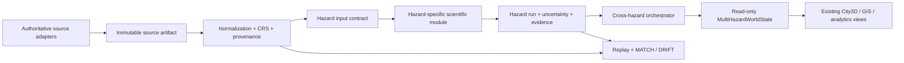

# Genesis Multi-Hazard Digital Twin — Audit and Architecture Roadmap

**Status:** Architecture audit only. This document proposes no hazard implementation and does not alter the completed City3D renderer, Scientific Core, Scenario Engine, Hospital Model, Discovery Engine, replay semantics, or `WorldEngineContract`.

## 1. Executive conclusion

Genesis already has a credible **epidemic digital-twin presentation layer**, a deterministic epidemic Scientific Core, read-only WorldState projection, Scenario/Evidence/Replay patterns, and an early provenance-bearing GIS import seam. It does **not** yet have a multi-hazard scientific model, a georeferenced authoritative world, a physical infrastructure dependency model, or validated cross-hazard cascade logic. The correct next milestone is therefore a shared, provenance-first **Hazard Engine foundation**, not the visual or scientific implementation of every hazard at once.

> The future product should be a family of independently validated hazard runs projected into one shared world, rather than one oversized solver that pretends to know every disaster mechanism.

| Current capability | What it enables | Hard limit today |
|---|---|---|
| `EpidemicCitySimulation` with deterministic clock, locations, agents, contacts, hospital resources, scenarios and replay | The epidemiology vertical is a mature reference implementation | It is epidemiology-specific and must not become a generic disaster solver |
| `projectWorldState(simulation)` | One read-only City3D data view with explicit `notModeled` declarations | The contract has no hazard, exposure, damage, weather, water, contamination, or utility state |
| City3D with one renderer/canvas/OrbitControls | A reusable visual host for real world-state projections | The current city is a deterministic synthetic layout, not a georeferenced municipality |
| OSM spatial import and `SpatialWorldOverlay` | EPSG:4326 base layers, source URL/timestamp, fingerprints, attribution and bounded world projection | `worldIntegration: NOT_WIRED`; it is a static scenario attachment and cannot yet drive a model |
| Scenario Capsule / Evidence Pack / replay fingerprints | The correct provenance and reproducibility pattern for future runs | Current replay is tied to canonical existing experiment requests, not hazard adapters |
| Road topology | A read-only geometry substrate for future exposure or accessibility analysis | It neither assigns routes nor models traffic, capacity, closure, evacuation, or disruption |

## 2. What Genesis already has, and what it lacks

The existing CityWorld has semantic homes, a shop, school, hospital, isolation facility and park. These locations truly influence current epidemic movement and contacts, so they are **not** generic city geometry. City3D also contains clearly separated visual-only context and approved assets. This distinction is valuable and must become a formal multi-hazard rule: a dataset, a model object and a visual mesh are three different things.

| Domain | Present now | Missing before a real Multi-Hazard Twin claim |
|---|---|---|
| Earthquake | None beyond a generic visual world | Event ingestion, ground-motion or scenario model, exposure model, damage/uncertainty model, validation corpus |
| Flood | Static water layer may be imported from OSM | Terrain/elevation, hydrology/hydraulics, rainfall/river/coastal driver, depth/velocity outputs, validated flood extent |
| Wildfire | No fire solver | Ignition/perimeter/detection ingestion, fuel/terrain/weather coupling, spread model, uncertainty and validation |
| Extreme weather | Explicitly `NOT_MODELED` in WorldState | Forecast/alert adapter, spatial hazard footprints, downscaling policy and impacts that are not inferred from icons |
| Contamination | No contaminant state | Source/release model, chemical metadata, dispersion or plume model, dose/exposure assumptions and safety review |
| Infrastructure | GIS data can be retained as static context | Asset registry, dependency graph, status/repair semantics, access control and validation against authoritative operators |
| Cascades | None | Explicit causal graph, compatible temporal semantics, uncertainty propagation, validation for every declared edge |

## 3. Recommended shared Hazard Engine architecture

The shared engine should be a small **orchestration and contract layer**, not a universal scientific algorithm. Each hazard keeps a bounded scientific module with its own assumptions, input schema, validation plan and output uncertainty. The orchestration layer accepts only versioned, provenance-bearing inputs and projects completed outputs into a common read-only display contract.

### 3.1 Core contracts

| Contract | Owner | Required properties | Prohibited behavior |
|---|---|---|---|
| `SourceArtifact` | Data/GIS layer | URL, provider, license, retrieval time, source time, checksum, CRS, bounding geometry, raw retention policy | Silent replacement, undocumented resampling or losing provenance |
| `HazardInput` | Hazard adapter | Version, normalized fields, units, spatial/temporal extent, assumptions, source fingerprints | Passing renderer values as scientific input |
| `HazardRun` | Scientific module | Hazard type, model/version, seed where stochastic, parameters, output fields, uncertainty, validation status | Claiming observation when the output is a scenario |
| `ExposureSnapshot` | World/GIS layer | Versioned asset/population/location references and mapping method | Treating synthetic CityWorld locations as real facilities |
| `ImpactResult` | Scientific module | Explicit result type, severity/unit, confidence or uncertainty, provenance links | Converting a visual intensity into a modeled impact |
| `CascadeEdge` | Orchestrator | Source output field, target input field, causal rationale, supported state, uncertainty mapping | Inventing a cross-hazard effect because it looks plausible |
| `MultiHazardWorldState` | Projection layer | Read-only layers, source run IDs, `notModeled`, timestamp alignment and status | Mutating a hazard or epidemic run from City3D |

### 3.2 Scientific Core versus visualization

| Belongs to Scientific Core | Belongs to data/GIS adapter | Belongs only to City3D visualization |
|---|---|---|
| Equations, thresholds, probability distributions, calibrated parameters, uncertainty, scenario execution, model validation and results | Acquisition, licensing, checksums, CRS conversion, geometry normalization, dataset versioning and bounded spatial joins | Meshes, materials, camera focus, non-scientific lighting, legends, read-only marker animation, LOD and selection UI |
| A fire-spread result, flood depth result, ground-motion result, plume concentration result or infrastructure status must be produced by a hazard module | An OSM/FEMA/USGS/NASA/EPA record is source context until explicitly mapped with a documented adapter | A flood surface, smoke, fire glow or damaged façade is **VISUAL_ONLY** unless linked to an actual `HazardRun` output |

The current epidemic `WorldStateView` must remain intact. A future `MultiHazardWorldState` should wrap or reference individual run projections and publish unsupported capabilities as `NOT_MODELED`; it must not retrofit unvalidated flood, fire, weather or infrastructure fields into the epidemic contract.

## 4. Data roadmap and provenance requirements

The minimum viable data policy is not "fetch a live API". Every use must retain the retrieved artifact, provider/URL, source timestamp, retrieval timestamp, license, CRS, checksum, normalization version, units, geographic extent and adapter version. Live feeds require snapshotting before they can be replayed. Observed data, alert data, forecast data and scenario outputs must have different labels.

| Hazard or layer | Candidate authoritative starting data | What it is suitable for | What it does **not** prove |
|---|---|---|---|
| Earthquake | USGS GeoJSON feeds and catalog; feeds contain event geometry/depth and properties and are intended for programmatic use [1] | Observed event ingestion, scenario trigger records and map context | Building damage, local shaking or casualties without a separately validated model |
| Flood | FEMA NFHL effective flood-hazard GIS database and web services [2] | Static flood-zone exposure context, spatial joins and scenario boundary selection | Live flood depth, flow velocity or event-time inundation |
| Water / flood operations | USGS water observations and local/agency hydrologic sources | Hydrologic observation artifacts if a scoped adapter is approved | A full hydraulic model or flood forecast by itself |
| Wildfire | NASA FIRMS near-real-time active-fire/hotspot data; detections have sensor-resolution limits and are not appropriate for tactical local decisions [3] | Observed fire-detection layer and scenario trigger provenance | Fire perimeter, fireline, spread rate or local safety decision |
| Weather / alerts | NWS API forecasts, alerts and observations, normally GeoJSON/JSON-LD and rate-limited [4] | Alert/forecast context with time and geography | Local downscaled impacts, building damage or climate projection |
| Contamination context | EPA FRS geospatial facilities and TRI-related public records [5] [6] | Facility/exposure-context inventory and provenance | A release event, plume, concentration or human dose |
| Infrastructure context | CISA/HIFLD and approved public counterparts; HIFLD itself advises validation before use in safety-affecting contexts [7] | Asset inventory and visual/GIS context, subject to access rules | Operational status, dependency, capacity, vulnerability or restoration state |
| Base world | Existing OSM adapter, expanded only after an audited relation/CRS/import policy | Buildings, roads, rail, water and boundaries as source context | Automatic calibration of the synthetic epidemic world to a real city |

## 5. Hazard-module sequence and real effort

This ordering prioritizes reusable contracts and hazards with cleanly bounded input/output semantics. Estimates are **planning ranges for one experienced engineer with domain review available**, not delivery commitments. Parallel specialists can reduce calendar time but not the need for validation.

| Phase | Scope | Primary owners | Indicative engineering effort | Exit criterion |
|---:|---|---|---:|---|
| 0 | Data governance, immutable artifacts, `HazardInput`/`HazardRun`, replay/evidence extension, geospatial adapter hardening | Kimi + Claude | 3–5 weeks | One provenance-rich no-impact dataset can be imported, replayed and visualized as source context only |
| 1 | Shared exposure registry, CRS/extent policy, `MultiHazardWorldState`, City3D read-only layer host | Kimi + Manus | 3–5 weeks | A real static hazard dataset appears in City3D with explicit source, status and `NOT_MODELED` disclosure |
| 2 | Earthquake scenario vertical slice | Claude + Kimi + Manus | 6–10 weeks | Validated scenario or observed-event adapter with documented uncertainty, evidence and non-fabricated impact outputs |
| 3 | Wildfire observation/scenario vertical slice with weather context | Claude + Kimi + Manus | 8–12 weeks | Detection/perimeter or validated scenario is separated from spread and shown with clear provenance |
| 4 | Flood vertical slice | Claude + Kimi + Manus | 10–16 weeks | Flood hazard/exposure first; only later depth/extent if a vetted hydrologic/hydraulic model and terrain data are available |
| 5 | Contamination and infrastructure dependency vertical slices | Claude + Kimi + Manus + domain experts | 12–20+ weeks | Release/asset status semantics are scientifically and operationally reviewed; access control is in place |
| 6 | Cascades | All, with explicit domain review | 12–24+ weeks after at least two validated vertical slices | Every edge is declared, testable, versioned, uncertainty-aware and supported by evidence |

## 6. Main risks and required controls

| Risk | Why it matters | Required control |
|---|---|---|
| False precision | Fine-looking maps and animated effects can imply a forecast or diagnosis not supported by the data | Mandatory status labels: `OBSERVED`, `FORECAST`, `SCENARIO`, `VISUAL_ONLY`, `NOT_MODELED`, plus uncertainty fields |
| Invalid spatial equivalence | The current CityWorld is synthetic; an OSM bounding box does not calibrate agents, contacts or hospital capacity | Keep `worldIntegration: NOT_WIRED` until a separately validated WorldAdapter is approved |
| Data licensing / sensitivity | Infrastructure and facility sources may be restricted, stale or unsuitable for public display | Dataset registry, entitlement boundary, retention policy, attribution and role-based release policy |
| Unsafe operational interpretation | Fire, flood, contamination and utility status can be mistaken for emergency direction | No evacuation, routing, tactical or safety recommendation feature without formal product, data and domain review |
| Cascade overreach | A plausible chain is not a validated causal link | Begin with no cascade; add only named, versioned edges with source/target semantics, tests and uncertainty |
| Performance collapse | Dense raster/mesh layers and particle effects can defeat City3D’s single-renderer budget | Tiles/LOD, precomputed vector simplification, instancing, layer budgets and benchmark gates at 260/500/1000 agents |
| Scientific coupling | Changes to epidemic contacts or hospital logic could invalidate prior evidence/replay | Hazard modules communicate through versioned, opt-in experiment inputs; no implicit mutation of `EpidemicCitySimulation` |

## 7. Ownership model

| Team | Primary responsibility | Must not own alone |
|---|---|---|
| Manus | One City3D renderer, read-only projections, layer hierarchy, visual `VISUAL_ONLY` context, performance and screenshot evidence | Hazard science, unreviewed causal rules or authoritative dataset interpretation |
| Claude | Scientific module design, experiment requests/results, Evidence/Replay/MATCH/DRIFT and validation harnesses | Renderer-specific duplication or silent GIS assumptions |
| Kimi | CRS/GIS adapters, source acquisition, spatial normalization, exposure registry and infrastructure data integration | Epidemiologic or physical hazard claims without domain validation |
| Domain reviewers | Hazard assumptions, calibration, uncertainty, validation and safe-use boundaries | UI-only sign-off as a substitute for scientific review |

## 8. Phase 0 Evidence/Replay review requirements

Claude's audit-only review of the current Evidence/Replay implementation confirms that the proposed contracts are compatible **only** if a future `HazardRun` remains the re-executable result of a pure function over a frozen `HazardInput`, explicit model configuration and seed where applicable. A live data fetch is not part of replay. Instead, a hazard replay must read the exact captured source artifact identified by its immutable content hash.

| Requirement | Phase 0 decision |
|---|---|
| Source artifact replay | `SourceArtifact` must retain immutable `contentHash`, retrieval time, source time, adapter/normalizer version, provenance and retained raw bytes or an approved immutable artifact reference. Replay must never re-fetch a live endpoint. |
| Replay status | If the identical captured artifact is unavailable, changed, incomplete or fails validation, replay returns `BLOCKED` or `NOT_REPRODUCIBLE`; it must never emit a false `MATCH`. |
| Versioning | `normalizerVersion`, `hazardModuleVersion` and the existing build-provenance `codeCommitHash` must be stored independently. CRS/unit/format normalization is executable scientific-adjacent code and cannot be treated as invisible preprocessing. |
| Fingerprints | `SourceArtifact.contentHash`, the complete canonical `HazardInput`, and `HazardRun.resultFingerprint` are immutable and fingerprinted at creation. `ExposureSnapshot` and `ImpactResult` are immutable derived projections whose provenance points to their originating `HazardRun`; they do not receive independent display-driven fingerprints. |
| Cascades | `CascadeEdge` remains **out of Phase 0**. A cascade requires a deterministic graph replay with ordered dependencies and chain-of-custody, not a single-run replay. |
| Scientific isolation | A hazard module cannot read or write `EpidemicCitySimulation`, `resolveContacts`, hospital capacity, Scenario Engine state, Discovery Engine state or `WorldEngineContract` except through a named, versioned, read-only adapter. Any future influence on an epidemic experiment must use an explicit opt-in request boundary, never a hidden state mutation. |
| Evidence reuse | Generalize the existing EvidenceStore/evidenceCrypto pattern behind a domain-neutral interface before adding hazard evidence. Do not create a third parallel evidence system. |

### 8.1 Required Phase 0 contract tests

| Test | Required assertion |
|---|---|
| Canonical serialization | Each of the six primary contracts serializes deterministically regardless of input key order. |
| Input sensitivity | Every scientifically relevant `HazardInput` change changes its input fingerprint; declared presentation-only fields do not. |
| Honest replay | The same frozen artifact, same normalized input, model configuration and seed re-execute to `MATCH`; an actual input or output change yields `DRIFT`. |
| Missing-artifact gate | Missing, modified or hash-mismatched source data yields `BLOCKED` / `NOT_REPRODUCIBLE`, never `MATCH`. |
| Store immutability | An attempt to create an existing artifact or input ID with different content is rejected. |
| Evidence completeness | Missing mandatory provenance, version or model fields blocks evidence-pack admission. |
| Hazard/epidemic isolation | A hazard run cannot mutate or implicitly read epidemiological simulation state; an attempted undeclared dependency fails. |

## 9. Revised recommended next decision

Approve **Phase 0 only**: design and test the domain-neutral evidence/data-provenance boundary for frozen artifacts and no-cascade `HazardRun` requests. Do **not** create `ExposureSnapshot`, `ImpactResult`, `CascadeEdge`, a physical hazard solver, a cross-hazard orchestrator or a new City3D layer yet. The first vertical slice should be chosen only after the target geography, intended use (research demonstration versus operational support), licensing constraints and available scientific reviewer are explicitly decided. Earthquake is the most tractable first candidate; flood should not be chosen first if the objective includes dynamic depth/velocity, because it requires terrain and hydrologic/hydraulic validation that Genesis does not currently possess.

## References

[1]: https://earthquake.usgs.gov/earthquakes/feed/v1.0/geojson.php "USGS GeoJSON Summary Format"
[2]: https://www.fema.gov/flood-maps/national-flood-hazard-layer "FEMA National Flood Hazard Layer"
[3]: https://www.earthdata.nasa.gov/data/tools/firms "NASA FIRMS"
[4]: https://www.weather.gov/documentation/services-web-API "NOAA National Weather Service API"
[5]: https://www.epa.gov/frs/geospatial-data-download-service "EPA Facility Registry Service Geospatial Data Download"
[6]: https://www.epa.gov/toxics-release-inventory-tri-program "EPA Toxics Release Inventory"
[7]: https://www.cisa.gov/resources-tools/resources/mapping-your-infrastructure-datasets-infrastructure-identification "CISA infrastructure identification datasets"
